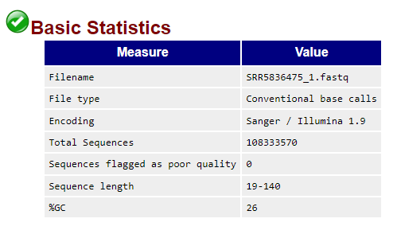
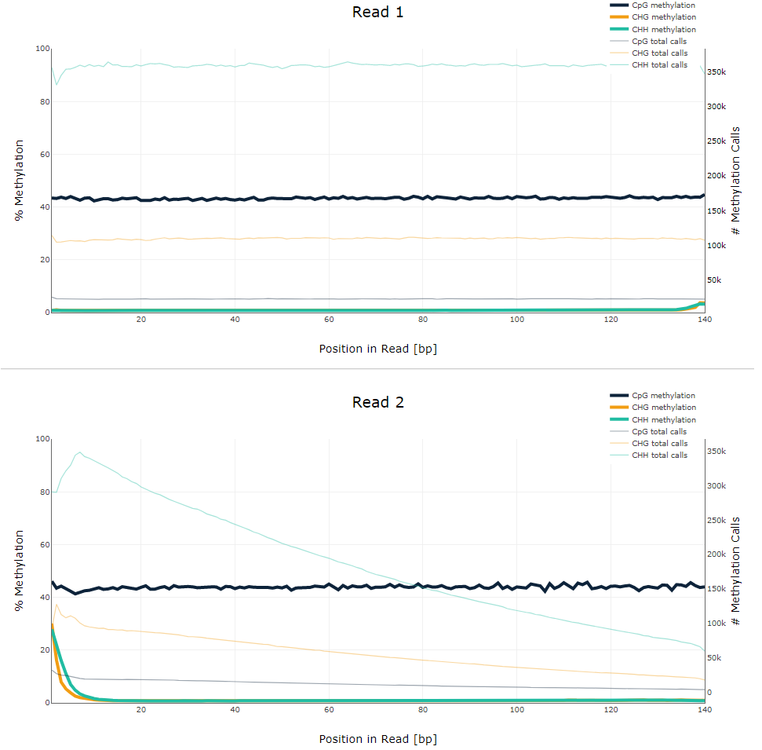
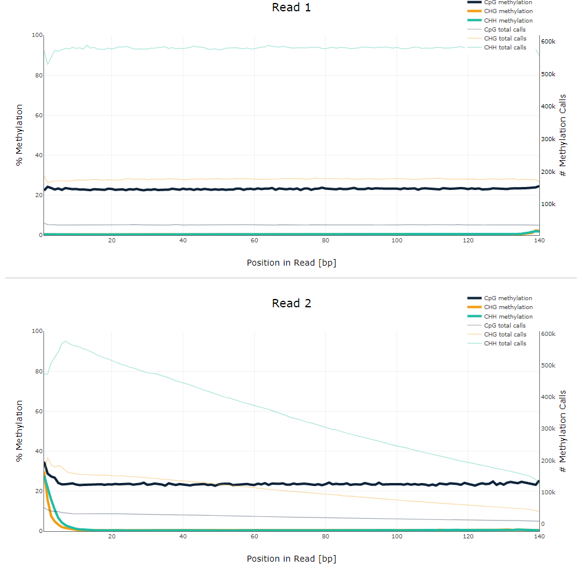
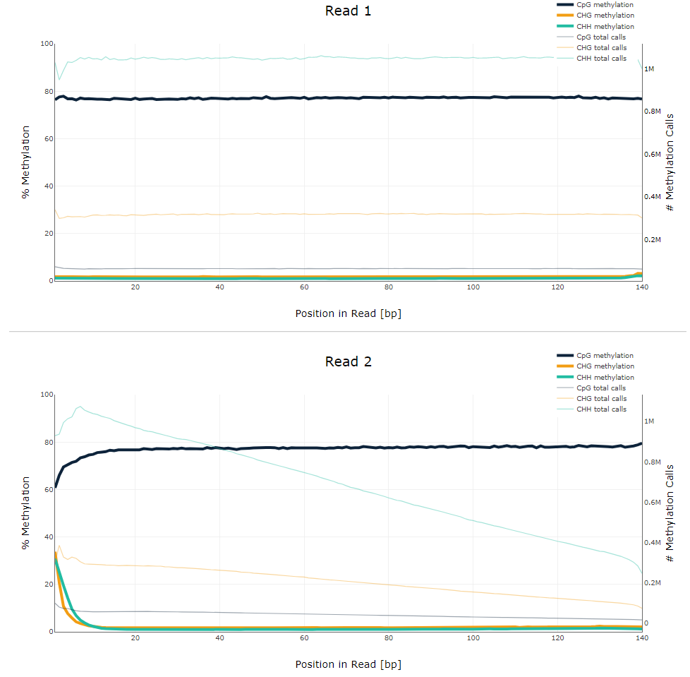
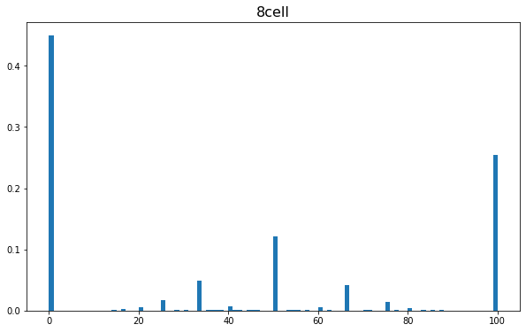
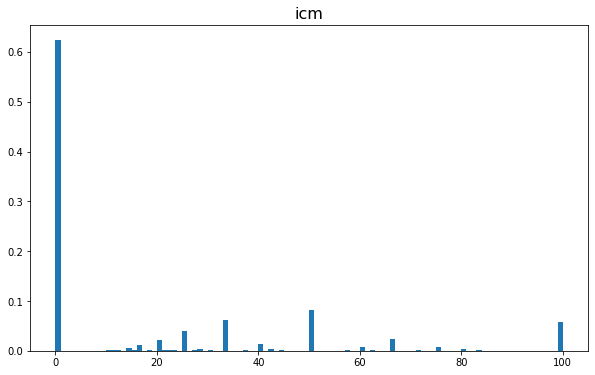
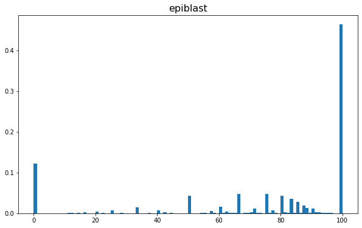

# 1. Анализ QC прочтений
[Ссылка на отчет](reports/SRR5836475_1_fastqc.html)



Можно заметить, что доля GC для QC-прочтений значительно меньше, чем для ДНК- или РНК-последовательностей. Это объясняется особенностями бисульфитного секвенирования: бисульфит действует на одноцепочечную ДНК, превращая неметилированный цитозин в урацил.

# 2. Google Colab
### [Ссылка на ноутбук](https://colab.research.google.com/drive/1P6IhEQEEP3xIeB0i0m0KzHNYSH4Bf945?usp=sharing)

## Число ридов, закартированных на участки 11347700-11367700; 40185800-40195800?
| _образец / участок_ | **11347700-11367700** | **40185800-40195800** |
|:-------------------:|:---------------------:|:---------------------:|
|      **8cell**      |          1090         |          464          |
|       **icm**       |          1456         |          630          |
|     **epiblast**    |          2328         |          1062         |
## Сколько процентов прочтений дуплицированно в каждом из образцов?
bash-скрипт для выполнения дедупликации для всех образцов одновременно:
```
ls *bt2_pe.bam | xargs -P 2 -tI{} deduplicate_bismark --bam --paired  -o s_{} {}
```
| **образец** | **% прочтений дуплицировано** |
|:-----------:|:-----------------------------:|
|    8cell    |             18.31%            |
|     icm     |             9.08%             |
|   epiblast  |             2.92%             |
## M-bias plot
По M-bias plot можно увидеть, что так называемые волны деметилирования-метилирования и правда наблюдаются: метилирование уменьшилось с 43% в стадии 8cell до 23% в стадии ICM, а затем в стадии Epiblast сильно увеличилось до 78%.
### 8cell
[Ссылка на отчет](reports/SRR5836473_1_bismark_bt2_PE_report.html)

### icm
[Ссылка на отчет](reports/SRR5836475_1_bismark_bt2_PE_report)

### epiblast
[Ссылка на отчет](reports/SRR3824222_1_bismark_bt2_PE_report.html)

## Гистограммы распределения метилирования цитозинов по хромосоме
По гистограммам можно увидеть, что 100% метилирование чаще всего встречается в стадии Epiblast, реже в стадии 8cell и очень редко в стадии ICM.




## Уровень метилирования и покрытия для каждого образца
### Уровень метилирования

### Уровень покрытия
